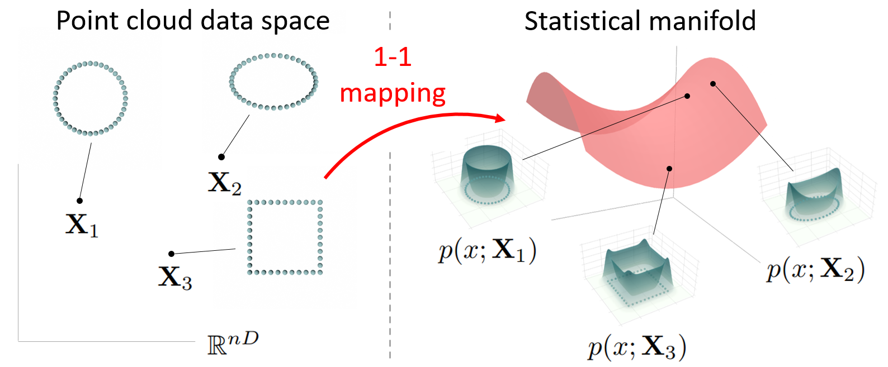
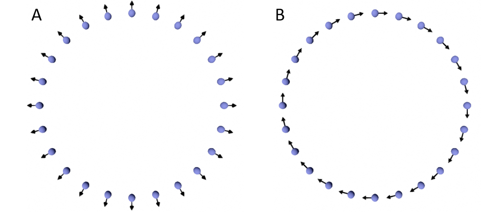
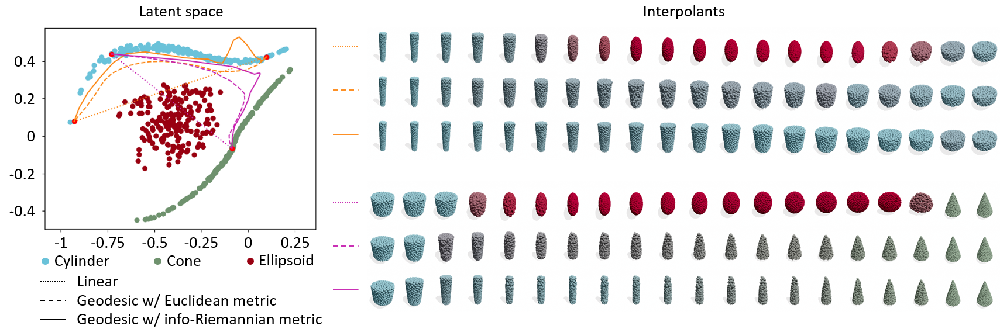
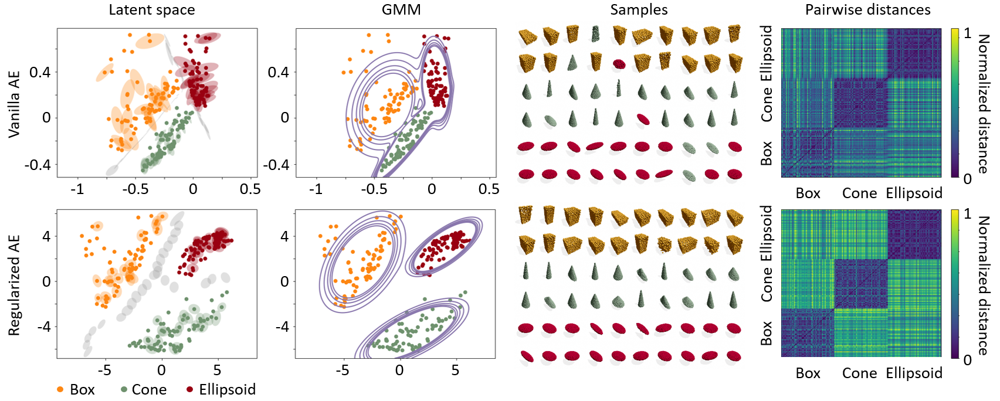

# A Statistical Manifold Framework for Point Cloud Data
The official repository for \<A Statistical Manifold Framework for Point Cloud Data\> (Yonghyeon Lee*, Seungyeon Kim*, Jinwon Choi, and Frank C. Park, ICML 2022).

<sup>\*</sup> The two lead co-authors contributed equally.

> This paper proposes a new Riemannian geometric structure for the space of point cloud data, using the theory of statistical manifold and information geometry, with applications to point cloud autoencoders.

- *[Paper](https://proceedings.mlr.press/v162/lee22d/lee22d.pdf)* 
- *[5-mins video](https://www.youtube.com/watch?v=PIiHt3KVxIo)*
- *[Slides](https://docs.google.com/presentation/d/1NvPuEoXqi93NKw13b4xzb84gT_viRG8O/edit?usp=sharing&ouid=102571685065826150745&rtpof=true&sd=true)*
- *[Poster](https://drive.google.com/file/d/1NuyQaG-g3zwWQEl6qS5tl5_H3oKsEzcK/view?usp=sharing)*  

## Preview
### Statistical Manifold and Information Geometry
<!-- <center>
<div class="imgCollage">
<span style="width: 50.0%"></span>
<span style="width: 50.0%"> </span>
</div>
  <I>Figure 1: De-noising property of the NRAE (Left: Vanilla AE, Middle: NRAE-L, Right: NRAE-Q). </I>
</center> -->
<center>

</center>
<I> Figure 1: Two moving point clouds with different velocity
matrices. </I>

### Geodesic Point Cloud Interpolation

<I> Figure 2: Left: Latent space with linear and geodesic interpolants. The orange interpolants connect a wide cylinder to a tall cylinder, while the magenta interpolants connect a cylinder to a cone. Linear interpolants and geodesic interpolants under the Euclidean and info-Riemannian metrics are drawn as dotted, dashed, and solid lines, respectively. Right: Generated point clouds from those interpolants. </I>

### Point Cloud Autoencoder Regularization

<I>Figure 3: From left to right: latent spaces with equidistant
ellipse $\{z|(z-z^*)^T G(z^*) (z-z^*) = 1\}$ centered on
some selected points $z^*$, Gaussian Mixture Model
(GMM) fitting results, generated samples from the GMM, and the heat map of the pairwise Euclidean distances in the latent space of all test data. The upper figure is a vanilla autoencoder trained without regularization, while the lower figure is trained with regularization (using the proposed info-Riemannian metric). </I>

## Progress
- [x] Training script (`train.py`)
- [x] Dataset upload
- [x] Pre-trained model upload
- [ ] Point cloud interpolation script (`interpolation.py`)
- [ ] Regularization effect visualization script (`regularization.py`)
- [ ] Data generation script (`data_generation.py`)
- [ ] Tips for playing with code

## Requirements
### Environment
The project is developed under a standard PyTorch environment.
- python 3.8.8
- numpy
- pytorch 1.8.0
- CUDA 11.3
- tensorboard 2.4.1

### Datasets
Datasets should be stored in `datasets/` directory. Datasets can be set up as follows.
- For synthetic 3D basic shape dataset, you can download through the [Google drive link](https://drive.google.com/drive/folders/1NuGq2LtWG627r9BNPzb1EegUuIvPUzDr?usp=sharing).

- For standard benchmark dataset (ModelNet10, ModelNet40, and ShapeNetCore.v2), you can download through the [Github link](https://github.com/antao97/PointCloudDatasets).

- (Optional) or (ii) If you want to generate your own custom basic 3D shape dataset, run the following script:
```
preparing...
```

After set up, the `datasets/` directory should be as follows.
```
datasets
├── interpolation_dataset
├── modelnet10_hdf5_2048
├── modelnet40_hdf5_2048
├── regularization_dataset
└── shapenetcorev2_hdf5_2048
```

### Pretrained model
Pre-trained models should be stored in `pretrained/`. The pre-trained models are provided through the [Google drive link](https://drive.google.com/drive/folders/1NuYIfyU6kVQ09qPR6rONWrernKMps_FX?usp=sharing). After set up, the `pretrained/` directory should be as follows.
```
pretrained
├── interpolation_config
│   ├── vanilla
│   └── regularized
└── regularization_config
    ├── vanilla
    └── regularized
```

## Running 
### Training
Training on synthetic 3D basic shape dataset for interpolation experiment (Section 4.1.1):
```
python train.py --config configs/interpolation_config.yml --model.fm_reg {F}
```
- `F` is either `None` or `10000000`.

Training on synthetic 3D basic shape dataset for regularization experiment (Section 4.1.2):
```
python train.py --config configs/regularization_config.yml --model.fm_reg {A}
```
- `F` is either `None` or `10000000`.

Training on standard benchmark dataset (Section 4.2, Table 2):
```
python train.py --config configs/{M}_config.yml --model.fm_reg {F} 
```
- `M` is either `fcnet`, `foldingnet`, `pointcapsnet`, or `dgcnnfcnet`.
- `F` is either `None` or positive real numbers (see Appendix D.2.1 for the values ​​used).

Training on standard benchmark dataset for noisy and semi-supervised settings (Section 4.2, Table 3 and Table 4):
```
python train.py --config configs/fcnet_{E}_{V}_config.yml --model.fm_reg {F} 
```
- `E` is either `noise` or `semi`.
- If `E` is `noise`, then `V` is either `1`, `5`, `10`, or `20`. If `E` is `semi`, then `V` is either `50`, `10`, `5`, or `1`.
- `F` is either `None` or `8000`.

> **Tips for playing with code:** preparing...

### Interpolation
preparing...

### Regularization
preparing...

## Citation
If you found this library useful in your research, please consider citing:
```
@inproceedings{lee2022statistical,
  title={A Statistical Manifold Framework for Point Cloud Data},
  author={Lee, Yonghyeon and Kim, Seungyeon and Choi, Jinwon and Park, Frank},
  booktitle={International Conference on Machine Learning},
  pages={12378--12402},
  year={2022},
  organization={PMLR}
}
```